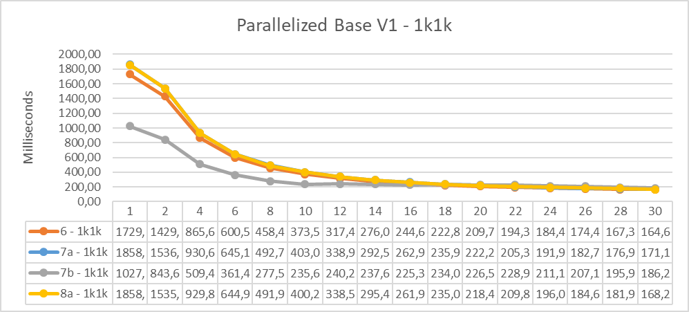
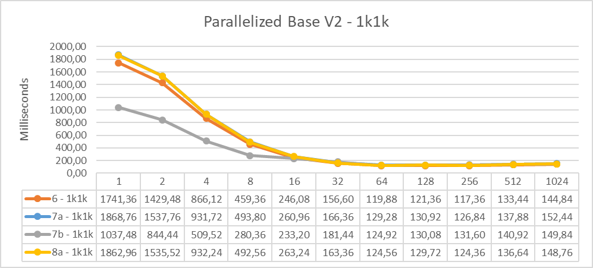
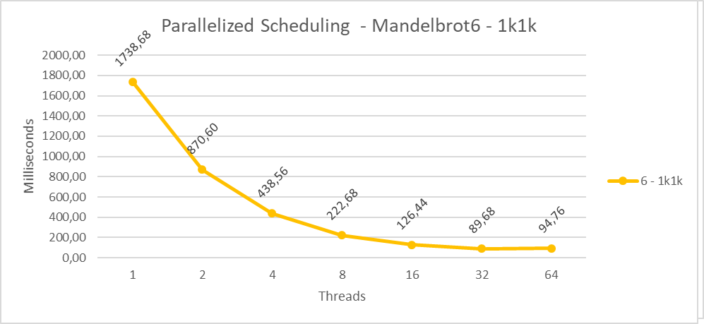
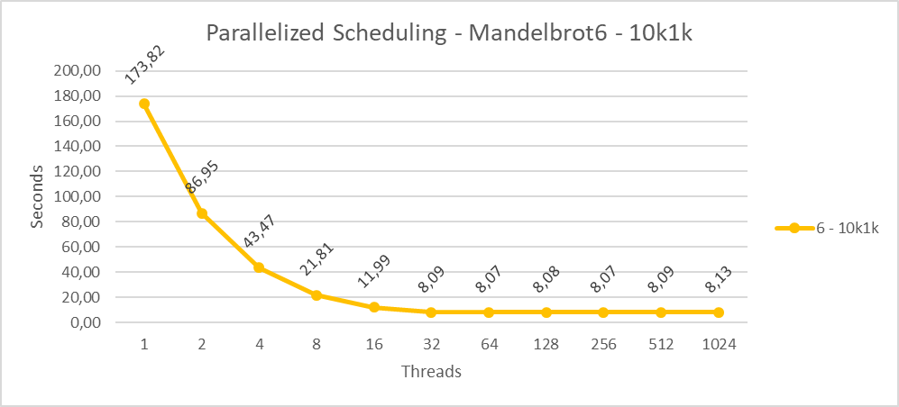

# High performance computing project

## Optimisation of the Mandelbrot set

### introduction

The Mandelbrot set is a two-dimensional structure that has a relatively straightforward definition, but can become quite complex when it's magnified. The popularity of it stems from its aesthetic appeal and fractal structures. In the complex plane, the set is defined by the complex numbers c and the function $f_c(z)=z^2+c$ is applied to them recursively.

$$
z_{n+1} = z_{n}^2 + c
$$

```cpp
int main(int argc, char **argv)
{
    int *const image = new int[HEIGHT * WIDTH];

    const auto start = chrono::steady_clock::now();
    for (int pos = 0; pos < HEIGHT * WIDTH; pos++)
    {
        image[pos] = 0;

        const int row = pos / WIDTH;
        const int col = pos % WIDTH;
        const complex<double> c(col * STEP + MIN_X, row * STEP + MIN_Y);

        // z = z^2 + c
        complex<double> z(0, 0);
        for (int i = 1; i <= ITERATIONS; i++)
        {
            z = pow(z, 2) + c;

            // If it is convergent
            if (abs(z) >= 2)
            {
                image[pos] = i;
                break;
            }
        }
    }
    const auto end = chrono::steady_clock::now();
    cout << "Time elapsed: "
         << chrono::duration_cast<chrono::seconds>(end - start).count()
         << " seconds." << endl;

 //...

} 
```

This algorithm makes it possible to iterate over the space of the complex numbers under consideration (MIN_X, MIN_Y, MAX_X, MAX_Y) with a certain RESOLUTION (the final output will have dimensions of WIDTH times HEIGHT, respectively the number of unique real components and the immaginary ones). 

The part to be optimised in this algorithm is (obviously) the entire for loop, this is confirmed both by the compiler report and by ONEAPI, which reports that there is a bottleneck in that loop (especially in the innermost for loop).

```
LOOP BEGIN at mandelbrot.cpp(33,5)
   remark #25096: Loop Interchange not done due to: Imperfect Loop Nest (Either at Source or due to other Compiler Transformations)
   remark #25451: Advice: Loop Interchange, if possible, might help loopnest. Suggested Permutation : ( 1 2 ) --> ( 2 1 ) 
   remark #15541: outer loop was not auto-vectorized: consider using SIMD directive

   LOOP BEGIN at mandelbrot.cpp(43,9)
      remark #15520: loop was not vectorized: loop with multiple exits cannot be vectorized unless it meets search loop idiom criteria   [ mandelbrot.cpp(48,13) ]
   LOOP END
LOOP END

LOOP BEGIN at mandelbrot.cpp(78,9)
   remark #26015: Exception can be thrown by the call to std::basic_ostream<char, std::char_traits<char>>::operator<<(std::basic_ostream<char, std::char_traits<char>> *, int)   [ mandelbrot.cpp(80,24) ]
   remark #15333: loop was not vectorized: exception handling for a call prevents vectorization   [ mandelbrot.cpp(80,24) ]
LOOP END


Non-optimizable loops:


LOOP BEGIN at mandelbrot.cpp(76,5)
   remark #15333: loop was not vectorized: exception handling for a call prevents vectorization   [ mandelbrot.cpp(80,24) ]
LOOP END

    Report from: Code generation optimizations [cg]
```

The full report can be found in Reports/mandelbrot.optrpt

#### Method of collecting execution times

All the changes that will be shown in the following paragraphs have been tested with four main configurations:

| **Configuration Name** | 1k-1k | 1k-10k | 10k-1k | 10k-10k |
| ---------------------- | ----- | ------ | ------ | ------- |
| **RESOLUTION**         | 1000  | 1000   | 10000  | 10000   |
| **ITERATIONS**         | 1000  | 10000  | 1000   | 10000   |

All measurements were collected by running the codes multiple times, in order to obtain data that better represents the various execution times.
On average, measurements were performed between 15 and 50 times, with the exception of the 10k-10k configuration where only one measurement was performed due to its time constraints.

All tests related to this project were carried out on computers with the following characteristics:

- OS: Debian GNU/Linux 11
- CPU: Intel Core i9-12900k x 24
- Memory: 64GB
- GPU: Nvidia T400

### Optimization

#### Vectorization

First we noticed that the component of the imaginary `STEP`/`WIDTH` part of the variable c is unnecessarily calculated at each iteration, so we can move it outside the loop in order to calculate it only once:

```cpp
const double step_width = STEP/WIDTH;

for (int pos = 0; pos < HEIGHT * WIDTH; pos++)
{
    image[pos] = 0;

    const int col = pos % WIDTH;
    const complex<double> c(col * STEP + MIN_X, pos * step_width + MIN_Y);

    // z = z^2 + c
    complex<double> z(0, 0);
    for (int i = 1; i <= ITERATIONS; i++)
    {
        z = pow(z, 2) + c;

        // If it is convergent
        if (abs(z) >= 2)
        {
            image[pos] = i;
            break;
        }
    }
}
```

This modification can be found in the file Vectorized/mandelbrot1.cpp

---

The next change was to split the outermost `for` so as to exploit 2 different coordinates (X,Y) in order to have more freedom when parallelising and because in this way we can avoid calculating the variable `col` at each iteration.

```cpp
for (int y = 0; y < HEIGHT; y++)
{
    for (int x = 0; x < WIDTH; x++)
    {
        const int pos = y * WIDTH + x;
        image[pos] = 0;

        const complex<double> c(x * STEP + MIN_X, y * STEP + MIN_Y);

        // z = z^2 + c
        complex<double> z(0, 0);
        for (int i = 1; i <= ITERATIONS; i++)
        {
            z = pow(z, 2) + c;

            // If it is convergent
            if (abs(z) >= 2)
            {
                image[pos] = i;
                break;
            }
        }
    }
}
``

This modification can be found in the file Vectorized/mandelbrot2.cpp

<div style="page-break-after: always; break-after: page;"></div>

We then moved the entire imaginary part of the variable c outside the loop `for (int x = 0; x < WIDTH; x++)` as it is sufficient to calculate it once as well (we did not do the same with `y * WIDTH` in `const int pos = y * WIDTH + x;` as it would then be converted into a FMA and thus it makes no difference).

```cpp
for (int y = 0; y < HEIGHT; y++)
{
    const double row = y * STEP + MIN_Y;
    for (int x = 0; x < WIDTH; x++)
    {
        const int pos = y * WIDTH + x;
        image[pos] = 0;

        const complex<double> c(x * STEP + MIN_X, row);

        // z = z^2 + c
        complex<double> z(0, 0);
        for (int i = 1; i <= ITERATIONS; i++)
        {
            z = pow(z, 2) + c;

            // If it is convergent
            if (abs(z) >= 2)
            {
                image[pos] = i;
                break;
            }
        }
    }
}
```

This modification can be found in the file Vectorized/mandelbrot3.cpp

<div style="page-break-after: always; break-after: page;"></div>

The next modification we decided to make is to exploit the symmetry of the complex numbers (with the assumption, however, that the considered area is symmetrical with respect to the real axis). Specifically, we have halved the period of the outermost for loop and within the loop of `x` we have also inserted the calculation of the conjugate complex of the respective `pos` position to "mirror" the result. We opted to divide only the period of the loop of y also to access the array with unitary steps rather than constant ones.

```cpp
const int HALF_HEIGHT = ceil((float) HEIGHT/2);

for (int y = 0; y < HALF_HEIGHT; y++)
{
    const double row = y * STEP + MIN_Y;
    for (int x = 0; x < WIDTH; x++)
    {
        const int pos1 = y * WIDTH + x,
                  pos2 = (HEIGHT - y - 1) * WIDTH + x;
        image[pos1] = image[pos2] = 0;

        const complex<double> c(x * STEP + MIN_X, row);

        // z = z^2 + c
        complex<double> z(0, 0);
        for (int i = 1; i <= ITERATIONS; i++)
        {
            z = pow(z, 2) + c;

            // If it is convergent
            if (abs(z) >= 2)
            {
                image[pos1] = image[pos2] = i;
                break;
            }
        }
    }
}
```

This modification can be found in the file Vectorized/mandelbrot4.cpp

<div style="page-break-after: always; break-after: page;"></div>

Another small change we made was to move the part `(HEIGHT - y - 1)` in `pos2 = (HEIGHT - y - 1) * WIDTH + x;` outside the for loop, again to avoid calculating the same result several times. (in this case too we have left WIDTH inside the for loop because it is then converted into an FMA).

```cpp
for (int y = 0; y < HALF_HEIGHT; y++)
{
    const double row = y * STEP + MIN_Y;
    const int y2 = HEIGHT - y - 1;

    for (int x = 0; x < WIDTH; x++)
    {
        const int pos1 = y * WIDTH + x,
                  pos2 = y2 * WIDTH + x; 
        image[pos1] = image[pos2] = 0;

        const complex<double> c(x * STEP + MIN_X, row);

        // z = z^2 + c
        complex<double> z(0, 0);
        for (int i = 1; i <= ITERATIONS; i++)
        {
            z = pow(z, 2) + c;

            // If it is convergent
            if (abs(z) >= 2)
            {
                image[pos1] = image[pos2] = i;
                break;
            }
        }
    }
}
```

This modification can be found in the file Vectorized/mandelbrot5.cpp

<div style="page-break-after: always; break-after: page;"></div>

We then removed the complex library, but made an important assumption: we only consider the maderblot generation function to be of order 2.

We therefore used double variables instead of the library to represent the imaginary parts of the variables `c` and `z`, we then added 2 auxiliary variables in order to avoid calculating the square of the imaginary and real parts several times and then we updated the `if` condition `abs(z) >= 2` in order to avoid the expensive calculation of the square root (this is because abs corresponds to the square root of the sum of the square of the imaginary and real component).

```cpp
for (int y = 0; y < HALF_HEIGHT; y++)
{
    const double ci = y * STEP + MIN_Y;
    const int y2 = HEIGHT - y - 1;

    for (int x = 0; x < WIDTH; x++)
    {
        const int pos1 = y * WIDTH + x,
                  pos2 = y2 * WIDTH + x;
        image[pos1] = image[pos2] = 0;

        const double cr = x * STEP + MIN_X;

        // z = z^2 + c
        double zr = 0.0, zi = 0.0, zr2 = 0.0, zi2 = 0.0;
        for (int i = 1; i <= ITERATIONS; i++)
        {
            zi = 2 * zr * zi + ci;
            zr = zr2 - zi2 + cr;

            zr2 = zr * zr;
            zi2 = zi * zi;

            // If it is convergent
            if (zr2 + zi2 >= 4)
            {
                image[pos1] = image[pos2] = i;
                break;
            }
        }
    }
}
```

This modification can be found in the file Vectorized/mandelbrot6.cpp

<div style="page-break-after: always; break-after: page;"></div>

A further small change we made was to add the calculation of `zr` and `zr2` to have all the expressions in a FMA format (it is an operation that the compiler theoretically carries out automatically but we wanted to make it explicit).

```cpp
zi = zr * zi + ci;
zr = zr2 + cr;

zr2 = zr * zr;
zi2 = zi * zi;

// If it is convergent
if (zr2 + zi2 >= 4)
{
    image[pos1] = image[pos2] = i;
    break;
}

zr *= 2;
zr2 -= zi2;
```

This modification can be found in the file Vectorized/mandelbrot7.cpp

<div style="page-break-after: always; break-after: page;"></div>

We then tried to move the copy of `pos2` data outside of all the for loops in order to obtain sequential (and therefore faster) data access

```cpp
for (int y = 0; y < HALF_HEIGHT; y++)
{
    const double ci = y * STEP + MIN_Y;

    for (int x = 0; x < WIDTH; x++)
    {
        const int pos = y * WIDTH + x;
        image[pos] = 0;

        const double cr = x * STEP + MIN_X;

        // z = z^2 + c
        double zr = 0.0, zi = 0.0, zr2 = 0.0, zi2 = 0.0;
        for (int i = 1; i <= ITERATIONS; i++)
        {
            zi = zr * zi + ci;
            zr = zr2 + cr;

            zr2 = zr * zr;
            zi2 = zi * zi;

            // If it is convergent
            if (zr2 + zi2 >= 4)
            {
                image[pos] = i;
                break;
            }

            zr = 2;
            zr2 -= zi2;
        }
    }
}

for (int y = 0; y < HALF_HEIGHT; y++)
{
    const int y2 = HEIGHT - y - 1;
    for (int x = 0; x < WIDTH; x++)
    {
        image[y2] = image[y * WIDTH + x];
    }
} 
```

This modification can be found in the file Vectorized/mandelbrot8a.cpp

We have also tried to align the image array for faster data access, but there is not enough space to align such a large array.

---

Despite all these changes, it was not possible to vectorize these for loops because the innermost one contains an if with a `break`, which makes it incompatible with vectorization (as if that wasn't enough we also have a write before read and consequently it is even more difficult to vectorize them).

It could perhaps be solved by swapping the innermost for and one of the two outer ones to vectorise everything, but this would involve the excessive calculation of all the points over all iterations, even though it has already been shown that they converge.

---

### Results

|  |  |
| ----------------------------------------- | ----------------------------------------- |

|  |  |
| ----------------------------------------- | ----------------------------------------- |

As we can see the compiler (with the right flags) is able to significantly improve the execution time of the original script (and all our variants), the codes that have benefited the most are from mandelbrot6 to mandelbrot8a, reaching execution times with the basic resolution (1k-1k) of 1.7s against the 5 seconds of the original version in the best case.

<div style="page-break-after: always; break-after: page;"></div>

### Parallelization

From here onwards we will only consider the mandelbrot6-7-8a versions for parallelization as they are the ones that have proven to be the best.

The changes we have made are limited to adding pragmas: 

```cpp
#pragma omp parallel for
for (int y = 0; y < HALF_HEIGHT; y++)
{
    ...
}
```

This modification can be found in the file OpenMP/Base/mandelbrot6.cpp

We then created two versions of mandelbrot7 (7a and 7b). Version 7a underwent the same modifications as mandelbrot6, while maintaining the original differences between the two files. In version 7b, in addition to these modifications, we added the `simd` instruction. The execution times for the three codes are similar, so the `simd` instruction was tested only in mandelbrot7b.

```cpp
#pragma omp parallel for simd
```

As we said, the 8a has been modified to allow us to add the "omp for" pragma. We only specified a single `parallel`, which includes the two `#pragma omp for` inside it, in order to create and destroy the various threads once, saving a lot of execution time.

```cpp
#pragma omp parallel
{
    #pragma omp for
    for (int y = 0; y < HALF_HEIGHT; y++)
    {
        ...
    }

    #pragma omp for
    for (int y = 0; y < HALF_HEIGHT; y++)
    {
        ...
    }
}
```

<div style="page-break-after: always; break-after: page;"></div>

### Results

|  |  |
| ----------------------------------------- | ----------------------------------------- |
|  |  |

The image on the left gives a more detailed idea of execution times with different thread configurations while the one on the right shows us the same thing but with an exponential trend in order to have a more general view (both generated with flags Ofast and xHost).

As we can see, as the number of threads increases, performance tends to increase until it reaches the threshold of 64 threads, after which performance tends to worsen due to the overhead caused by the execution of so many threads.

Given these results we wanted to try applying dynamic scheduling to mandelbrot6 (as it is the one with the best performance in general). We opted for the dynamic version because the "image" to be generated is not regular at all (thus the constant version should be avoided) and it is really easy to find areas where there are both pixels that require only a handful of iterations and others that need to be iterated until the end (the guided version should also be avoided, as there is no pattern that allows it to be used efficiently).
Given these reasons (and thanks to the help of some tests) we opted for a scheduling size of 1.

```cpp
#pragma omp parallel for schedule(dynamic, 1)
```

|  |  |
| ----------------------------------------- | ----------------------------------------- |
|  |  |

As is evident, scheduling greatly improves code execution compared to versions that do not use it thanks to threads balancing.

<div style="page-break-after: always; break-after: page;"></div>

### CUDA

Given the results obtained in parallelism and vectorization we decided to take into consideration only the mandelbrot6 version. 

We have included four different versions:

- **mandelbrot6a**: same as the vectorised version, but we include the kernel call only on one dimension
  
  ```cpp
  __global__ void cuda_mandelbrot(int* image)
  {
      int y = blockIdx.x * blockDim.x + threadIdx.x;
  
      if (y < HALF_HEIGHT)
      {
          const double ci = y * STEP + MIN_Y;
          const int y2 = HEIGHT - y - 1;
  
          for (int x = 0; x < WIDTH; x++)
          {
              const int pos1 = y * WIDTH + x,
                        pos2 = y2 * WIDTH + x; // we exploit the simmetry of complex numbers: calculate only half figure and then mirror the results
              image[pos1] = image[pos2] = 0;
  
              const double cr = x * STEP + MIN_X;
  
              // z = z^2 + c
              double zr = 0.0, zi = 0.0, zr2 = 0.0, zi2 = 0.0;
              for (int i = 1; i <= ITERATIONS; i++)
              {
                  zi = 2 * zr * zi + ci;
                  zr = zr2 - zi2 + cr;
  
                  zr2 = zr * zr;
                  zi2 = zi * zi;
  
                  // If it is convergent
                  if (zr2 + zi2 >= 4)
                  {
                      image[pos1] = image[pos2] = i;
                      break;
                  }
              }
          }
      }
  }
  
  int main(int argc, char *argv)
  {
      intconst image = new int[HEIGHT * WIDTH];
  
      const auto start = chrono::steady_clock::now();
  
      float stripeFact = 1;
      dim3 threads(32, 1);
      dim3 blocks((HALF_HEIGHT - 1) * stripeFact/threads.x + 1, 1);
  
      int cuda_image;
  
      cudaMalloc(&cuda_image, HEIGHT WIDTH * sizeof(int));
      cuda_mandelbrot<<<blocks, threads>>>(cuda_image);
      cudaMemcpy(image, cuda_image, HEIGHT * WIDTH * sizeof(int), cudaMemcpyDeviceToHost);
  
      cudaFree(cuda_image);
  
      const auto end = chrono::steady_clock::now();
      cout << "Time elapsed: "
           << chrono::duration_cast<chrono::milliseconds>(end - start).count()
           << " milliseconds." << endl;
  
      ...
  
  }
  ```

- **mandelbrot6b**: very similar to 6a but in this case we iterate on two dimensions
  
  ```cpp
  __global__ void cuda_mandelbrot(int* image)
  {
      int x = blockIdx.x * blockDim.x + threadIdx.x;
      int y = blockIdx.y * blockDim.y + threadIdx.y;
  
      if (x < WIDTH && y < HALF_HEIGHT)
      {        
          ...
      }
  }
  
  int main(int argc, char **argv)
  {
      int *const image = new int[HEIGHT * WIDTH];
  
      const auto start = chrono::steady_clock::now();
  
      float stripeFact = 1;
      dim3 threads(128, 8);
      dim3 blocks((WIDTH - 1) * stripeFact/threads.x + 1, (HALF_HEIGHT - 1) * stripeFact/threads.y + 1);
  
      int *cuda_image;
  
      cudaMalloc(&cuda_image, HEIGHT * WIDTH * sizeof(int));
      cuda_mandelbrot<<<blocks, threads>>>(cuda_image);
      cudaMemcpy(image, cuda_image, HEIGHT * WIDTH * sizeof(int), cudaMemcpyDeviceToHost);
  
      cudaFree(cuda_image);
  
      const auto end = chrono::steady_clock::now();
      cout << "Time elapsed: "
           << chrono::duration_cast<chrono::milliseconds>(end - start).count()
           << " milliseconds." << endl;
  
      ...
  
  }
  ```

- **mandelbrot6c**: like version 6b but also as 8a: instead of sending the entire array to cuda, only half is calculated on the GPU and the other half it's copied by the CPU
  
  ```cpp
  __global__ void cuda_mandelbrot(int* image)
  {
      int x = blockIdx.x * blockDim.x + threadIdx.x;
      int y = blockIdx.y * blockDim.y + threadIdx.y;
  
      if (x < WIDTH && y < HALF_HEIGHT)
      {
          const int pos = y * WIDTH + x;
          image[pos] = 0;
  
          const double cr = x * STEP + MIN_X, 
                       ci = y * STEP + MIN_Y;
  
          // z = z^2 + c
          double zr = 0.0, zi = 0.0, zr2 = 0.0, zi2 = 0.0;
          for (int i = 1; i <= ITERATIONS; i++)
          {
              zi = 2 * zr * zi + ci;
              zr = zr2 - zi2 + cr;
  
              zr2 = zr * zr;
              zi2 = zi * zi;
  
              // If it is convergent
              if (zr2 + zi2 >= 4)
              {
                  image[pos] = i;
                  break;
              }
          }
      }
  }
  
  int main(int argc, char *argv)
  {
      intconst image = new int[HEIGHT * WIDTH];
  
      const auto start = chrono::steady_clock::now();
  
      float stripeFact = 1;
      dim3 threads(128, 8);
      dim3 blocks((WIDTH - 1) * stripeFact/threads.x + 1, (HALF_HEIGHT - 1) * stripeFact/threads.y + 1);
  
      int cuda_image;
  
      cudaMalloc(&cuda_image, HALF_HEIGHT WIDTH * sizeof(int));
      cuda_mandelbrot<<<blocks, threads>>>(cuda_image);
      cudaMemcpy(image, cuda_image, HALF_HEIGHT * WIDTH * sizeof(int), cudaMemcpyDeviceToHost);
  
      cudaFree(cuda_image);
  
      for (int y = 0; y < HALF_HEIGHT; y++)
      {
          const int y2 = HEIGHT - y - 1;
          for (int x = 0; x < WIDTH; x++)
          {
              image[y2] = image[y * WIDTH + x];
          }
      }
  
      ...
  
  }
  ```

- **mandelbrot6d**: in this case we tried other stripe factors other than 1 (the best one is 0.5 in our case)
  
  ```cpp
  float stripeFact = 0.5;
  ```

<div style="page-break-after: always; break-after: page;"></div>

###### Results


|  |  |  |
| ------------------------------------------------------ | ------------------------------------------------------ | ------------------------------------------------------ |

These graphs (generated with flags Ofast and xHost) were created with the 1k-1k configuration and due to the size of it the results are more or less quite similar, with the 6c being slightly better.

In the second "heatmap" of the first row it is clear how the best configurations are all concentrated around the configuration with x = 4/8 as it is the best compromise between the maximum size of the blocks and the number of adjacent complex points that have more or less different iteration numbers to converge.

Version 6a has very similar behavior to the one parallelized with OMP (except for execution times, as CUDA must save data from GPU memory to CPU memory).
As for the 6b-c-d there is always the question of compromise on block size and as for 6a it is clear that the best configurations always follow a number of threads equal to 32/64.

##### Overall results with different configurations

For all configurations of CUDA and OMP versions we used 1k-10k with the xHost and OFast flags like in 1k-1k, for the vectorized version instead we used only the flag xHost and alternated between O2 and Ofast.

For the 10k-1k configurations we directly opted for xHost and OFast, specifically for the vectorized version we only compare the original version with our mandelbrot6. 

In the CUDA and OMP versions we instead tried all the thread configurations to see which combinations of quality and number of threads produce the best results in terms of time (in the case of CUDA we only measured the execution of version 6c while for OMP we used version 6, due to time constraints).

For the 10k-10k in the vectorized case we measured the original version compared with our version 6, in parallelism we conformed version 6 with scheduling and in the CUDA version we always analyze 6c (for the last two we measured the best thread configurations again due to time constraints).

Below we report the results of the processing carried out with the remaining configurations (speedup graphs are not reported because they are identical to the previous ones):

|   |                            |
| ----------------------------- | ------------------------------------------------------- |
|                               |                                                         |
|  |  |

|  |  |
| ------------------------------------------------------- | ------------------------------------------------------- |
|  |  |
|  |                                                         |

|                                       | 10k-1k               | 10k-10k  |
| ------------------------------------- | -------------------- | -------- |
| mandelbrot (Vectorized)               | ~ 21min              | ~ 89min  |
| mandelbrot6 (Vectorized)              | ~ 3 min              | ~ 29 min |
| mandelbrot6 (Parallelized Scheduling) | (see previous graph) | 78.57s   |
| mandelbrot6c (CUDA)                   | (see previous graph) | ~ 5 min  |

As you can see, the parallelized versions are better than the CUDA versions and, specifically, those obtained with OMP are the best (speedup of 500), as we have already seen for the 1k-1k configuration, as the size of the problem increases, the gap in terms of performance between the various versions remains unchanged.

<div style="page-break-after: always; break-after: page;"></div>

Some renderings of the results we got by running the optimized codes:

|  |  |
| ------------------------- | -------------------------- |


The code used to convert the text output to image can be found on [Google Colab](https://colab.research.google.com/drive/1MdPbn7ejMLNaUp6ehm04_UqnW1cY4Myr?usp=sharing).
